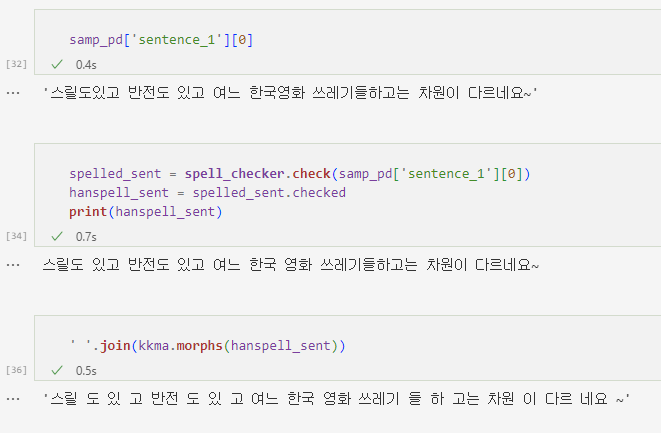
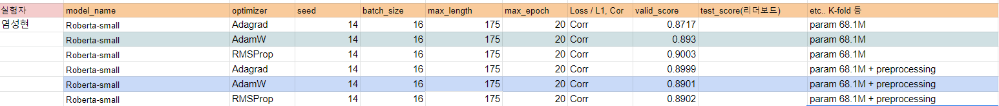

## Token 전처리 및 분절 실험 Report

### Idea

- 기존 BertTokenizer의 단어 분절이 이상함
    - vocab mapping이 잘 되는지 의문   

-> token 전처리의 필요성   
-> 한국어 품사 기준으로 token을 먼저 나눈 다음 tokenizer에 집어 넣자는 idea

### Code
- [clean_tokens](../codes/tokenizer_plus.ipynb)

### Experiment

- 원 문장과 맞춤법 검사 문장과 품사 기반 token 분절 문장 비교
- vocab 매핑이 더 잘 될 것이라 기대

### Results

- 성능이 크게 향상된 모습은 아니다.
- 그래도 모델 선택 후 코드를 반영해서 결과를 뽑아볼 생각이다.
