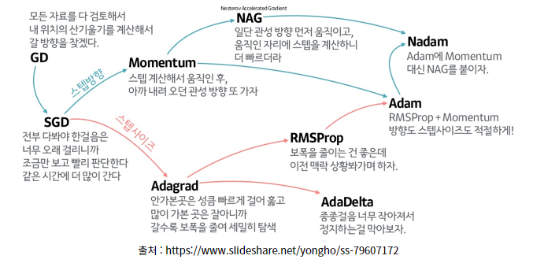
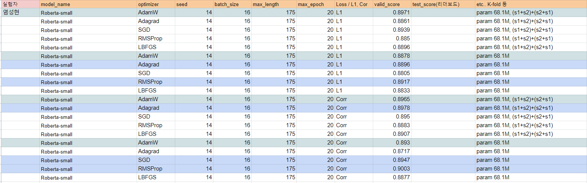

## Optimizer Report

#### reference site 

- [torch Optimizer](https://pytorch.org/docs/stable/optim.html)
- [optimizer 블로그 정리글](https://velog.io/@chang0517/Optimizer-%EC%A2%85%EB%A5%98-%EB%B0%8F-%EC%A0%95%EB%A6%AC)

### Optimizer Abstract  

  

- 

### Experiments

- 프로젝트에 기한적 한계가 존재하므로 임의의 Optimizer 5개를 선택하여 실험
- Loss를 L1, Corr 그리고 data를 original, original+reverse로 실험

### Results

- 기존 Baseline code의 AdamW를 기준으로 평가
- RMSProp, Adagrad 등의 성능이 좋게 나오는 경우가 있었음
- SGD의 성능이 더 좋은 경우도 있었으나 Case가 1개로 그침
- 모델이 정해진 후에 AdamW, RMSProp, Adagrad 등으로 실험하는 것이 좋을 듯