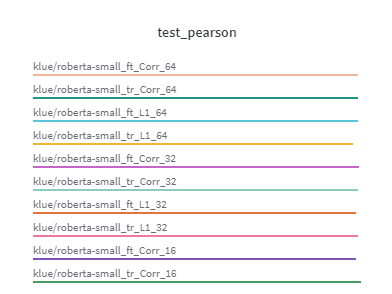
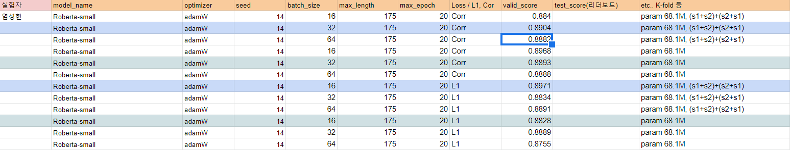

## Sentence Reverse Report

### Idea

과제가 sentence 1과 sentence 2의 유사도를 비교하는 것이고  
현재 sentence 1과 sentence 2의 데이터가 중복되지 않는다면  
sentence 1과 sentence 2의 순서를 뒤집어서 데이터를 늘려보자.

### Code

- [Sen_plus](../codes/sen_plus.py)
- 두 문장 순서를 바꾼 뒤 원 데이터 아래에 concat하여 붙임

### Experiment

- roberta-small을 base model로 하여 batch와 loss 계산을 달리하며 score를 산출  
  

### Results

- 데이터를 늘린 데이터셋의 score 가 원 데이터셋의 score 보다 높은 경우도 있었으나 이것이 유의미한 지는 판단하기 어려웠음
- test 데이터에서 어떠한 차이가 나타나는지 검증할 필요가 있음
- 최종 모델이 정해진 후 추가 실험이 필요해 보임

