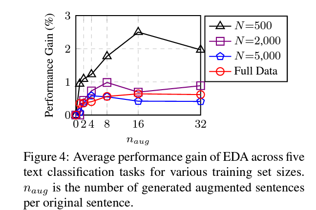

## Text Augmentation Report

#### reference site 

- [관련 논문](https://arxiv.org/abs/1901.11196)
- [DBSA 발표 자료](http://dsba.korea.ac.kr/seminar/?mod=document&uid=1328)
- [구현 코드](https://github.com/catSirup/KorEDA/blob/master/eda.py)

### code

[text_aug_rs](../codes/rs.ipynb)
- 단어의 위치를 바꾸는 RS 방법론 만 사용하였다.
- Reference에서 RS, RD 만을 추천하였기 때문에 보수적으로 실험을 진행하였다.
- pororo dependency가 맞지 않음에 따라 back translation은 사용하지 않았다.

### 논문 내용
- - -
- 구현 방식 소개
    - SR : stop words가 아닌 n개의 단어를 무작위로 선택, 랜덤한 유의어로 교체
    - RI : stop word가 아닌 문장 내 무작위 단어의 무작위 유의어를 찾고 문장 내 무작위 위치에 삽입, n번 반복
    - RS : 문장 내 두 단어를 무작위로 선택하고 그 위치를 뒤바꿈, n번 반복
    - RD : p 확률로 문장 내의 각 단어를 무작위로 제거   
    

       
- 구현 예시
    - SR, RI, RS, RD   

- EDA(Easy data augmentation) 유무에 따른 성능 차이
    - full datasets에 대해 0.8의 평균 성능 향상치, N=500 일 때 3.0%.  

- original 문장과 augmented 문장의 Latent space 시각화
    - 증간된 문장이 원본 문장에 매우 근접해 있음을 확인할 수 있음  

- alpha 값에 따른 성능 변화
    - alpha =0.1 이 sweet spot  

  

- n (증강 문장 수)에 다른 성능 변화
    - table 3의 파라미터를 추천  

  
  

- EDA의 한계
    - 데이터가 충분할 때 성능 향상은 크지 않다.
    - pre-trained 모델 사용 시에 의미 있는 성능 향상을 가지지 못한다.
    - 관련 작업과의 공정한 비교는 중요하지 않다.  

