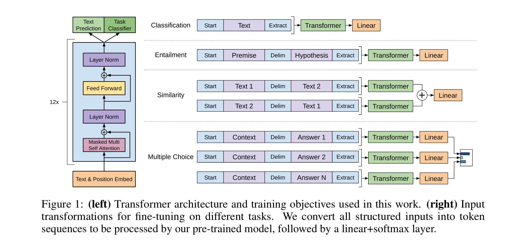

# Work Flow Doucmentation
#### NLP_14조_번역해조_T4126_염성현
- - -
## Thoughts
<u>10/26</u> : Data 접근 + Model 접근   
- - -
- Data 접근 : Augmentation + Feature Extraction + Tokenization + 전처리
    - Augmentation : Label 5 데이터 때문이라도 필요하지 않을까?
    - Feature Extraction : 각 라벨이 담고 있는 정보는 무엇일까? 부가적인 내용의 의미는?
    - Tokenization : BPE? 한국어에 맞는 방법은?
    - 전처리 : 불용어 처리, 대체 단어 탐색
        -> 필요한가?
        -> Embedding 측면으로 접근한다면?  
        #
- Model 접근 : Regression/Classification & proba threshold + Ensemble(WBF?, Weighted box fusion) + hyperparameter tuning
    - Regression이 Base, 경향성을 강화시키고 threshold를 주려면 Classification
    - Ensemble : 다양한 Ensemble 방법이 존재, 잘 짜여진 단일 모델이 Ensemble 보다 좋을 수 있다.
    - Hyperparameter tuning : Ray? wandb.sweep?  
    #
- Competition에 대한 고찰
    - 일반적인 대회   
        -> 당연히 성능, 순위가 중요, 타 대회 코드나 모듈에 의존   
    - 부스트 캠프 대회    
        -> 교육 과정, podium의 의미?, 과정과 기록, Struggle, 잘하는 걸 증명하기만 하는 것은 별 의미가 없다. 의존하느냐 협업하느냐.   
    - 코드 공유의 의미    
        -> 고도화 시키지 않은 코드는 공유해도 무방, podium에 들지 못할 가능성, 스스로를 어필하는 방법.   

- - -
### 1-1.EDA &insights
<u>pubilshed 10/25</u>   

[EDA File](../codes/simpler_eda.ipynb "to file")
- Raw data
    - 비문법적 표현, 인터넷 용어가 많이 보인다.
    - 단어의 분절(split)이 잘 되지 않은 문장들이 보인다.
    - 출현 횟수가 1 또는 적은 단어들이 많이 보인다.  
    #
- Label
    - 0 라벨 데이터의 숫자가 많고 그 비율 또한 상당히 높다.
    - 5 라벨 데이터의 숫자와 비율은 반면에 매우 적고 매우 낮다.
    - 0 라벨 데이터에 치우치거나 5 라벨 데이터 예측이 잘 안되는 것이 우려된다.
    - 5 라벨 최대 토큰 개수가 문장 길이에 비해 매우 적게 나왔다.   
        -> 단어의 분절화가 잘 이루어지지 않았거나 비문법적 표현이 많이 사용되었을 가능성이 있다.  
    #
- Sentence Length, Token Counts
    - 문장 길이는 40, 토큰 개수는 10을 기준으로 데이터 수가 급격히 줄어들었다.
    - 데이터의 치우침이 있는 것 같아 보인다. skewness 확인해 볼 필요성.  
    #
- Correlation
    - 약 0.8의 문장 길이 및 토큰 상관 계수
    - 두 문장 사이의 관계에서 이것이 유의미한 것인가는 더 따져봐야 함  
    #
- Source
    - 총 3가지 유형의 데이터 셋, 그러나 rtt와 sampled가 나뉘어 6개의 데이터셋이 있다.
    - 유형 별 train 성능을 비교해보는 것도 유의미할 것 같다.  
    # 
- Most tokens, n-gram
    - 전처리가 되지 않아 현재로서는 큰 의미를 갖지 못하는 것 같다.
    - 불용어 처리도 필요해 보이고 다양한 tokenization 방법론을 사용해 봐야할 것 같다.

### 1-2.Further

- 비문법적 표현 및 인터넷 용어 처리
- 불용어 처리
- 다양한 tokenization 방법 적용
- Data Augmentation, Data Filtering
    - 라벨 별 혹은 문장 길이 별 데이터 비율을 맞춰주는 것 고려
    - 라벨 별 혹은 문장 길이 별 데이터 filtering, 각각의 proba에 대해 각기 다른 threshold를 주는 것 고려
    - 출현 횟수가 적은 token에 대한 처리 고려

- - -
### 2-1. Label
<u>published 10/28</u>  

[Label Trace Note](../codes/label_trace_note.ipynb)
- (가설) label score의 의미는 두 문장 문장 주성분과 부속 성분, 독립 성분 correlation의 합
### 2-2. further work
- label 가설의 정립
    - base 코드 tokenization 출력 확인
    - 한국어 pos tagging 포함 tokenization
    - token embedding 시각화
    - label의 의미 명확화
- NLU
    - NLU 모델 설계(feature extraction)
    - 전처리, 데이터 증강
    - 과정 별 모델 성능 비교
- - -
### 3-1. pos-tagging
<u>published 10/31</u>  

[Pos-tagging EDA Note](../codes/pos_eda.ipynb)
- pos-tagging 실험 중, konlpy와 mecab 라이브러리 설치 및 사용이란 벽에 부딪힘
- 과정 중 tokenizer에 대해 조사하고 결과를 decode하여 문장이 어떻게 나뉘는지 관찰함
    - 해당 과정에서 팀원들과 토의 중, max_length의 의미와 활용에 대해 알게 됨
- 나뉜 문장에 pos-tagging을 하고 label 별로 유의미한 token을 찾아내는 것이 앞으로의 과제

### 3-2. Server setting & Run

>pip install —ignore-installed PyYAML  
>pip install -r requirements.txt

위의 코드를 활용해 requirements.txt의 라이브러리 설치  
-> 그러나 segmentation fault (core dumped) 문제 발생  
-> 위의 문제가 pytorch와 torchvision의 dependency 문제(cuda 버젼이 상이)임을 발견  
-> pytorch 버젼 확인 후, torchvision uninstall  
-> [pytorch previous ver](https://pytorch.kr/get-started/previous-versions/)을 확인하여 재설치     

tokenizer 설정이나 wandb, random seed 등의 관련 코드들을 기존 baseline code에 병합하는 작업을 함   
wandb와 random seed에 관련해선 팀원들의 도움을 받음   
Roberta-large를 wandb.sweep()을 활용해 최적의 hyper parameter를 찾으며 학습 중.

- - -
### 4-1. Pos EDA
<u>published 11/01</u>  

Roberta-Large 모델을 Batch_size를 달리해가며 돌렸음
- 최대 Batch_size 크기가 32였는데 32의 모델이 가장 성능이 우수하게 나왔음
- 더 많은 비교가 필요

Opitmizer Selection을 위한 작업을 마련해놓음, 추후 문서를 확인 후 적절한 Opitimizer를 뽑아 실험할 계획

[Pos EDA](../codes/pos_eda.ipynb)
- Konlpy 설치 후 Kkma를 통한 형태소 분석 시도
- AutoTokenizer로 불러오는 BertTokenizer가 한국어에 맞지 않음을 발견
    - 단어 분절이 이상하게 됨 (명사가 중간에 잘리는 등)
- Pos-tagging 후 Label 과의 상관관계를 관찰하였으나 유의미한 지표를 발견하지 못함
    - 문장 구성성분이 아닌 형태소 분석에 따른 것이 아닌가 싶음
    - 구성성분에 따라 형태소를 나누거나 다른 분석 방법을 도입하는 등의 방법이 있을 것 같음
    - 하지만 시간적인 한계가 존재하므로 구성성분 분석은 하지 않겠음

-> Pos-tagging을 적용해 Label을 활용하는 방안은 실패  
-> Pos-tagging을 적용해 전처리를 하거나 Tokenizer를 Customize하는 쪽으로 작업을 지속

### 4-2. Reverse sentence

[Sen_plus](../codes/sen_plus.py)
- GPT 논문에서 STS task에 대해 sentence1과 sentence2를 그대로 또 뒤집어서 넣는 것에서 착안
    
- Concat 하는 방식으로 학습 데이터 셋을 늘려보았음
- Score가 0.01 정도 차이 나는 것을 관측할 수 있었으나 좀 더 다양한 파라미터에 대해 실험할 계획
- GPT 논문의 구조를 재현하는 코드를 작성 중에 있음
