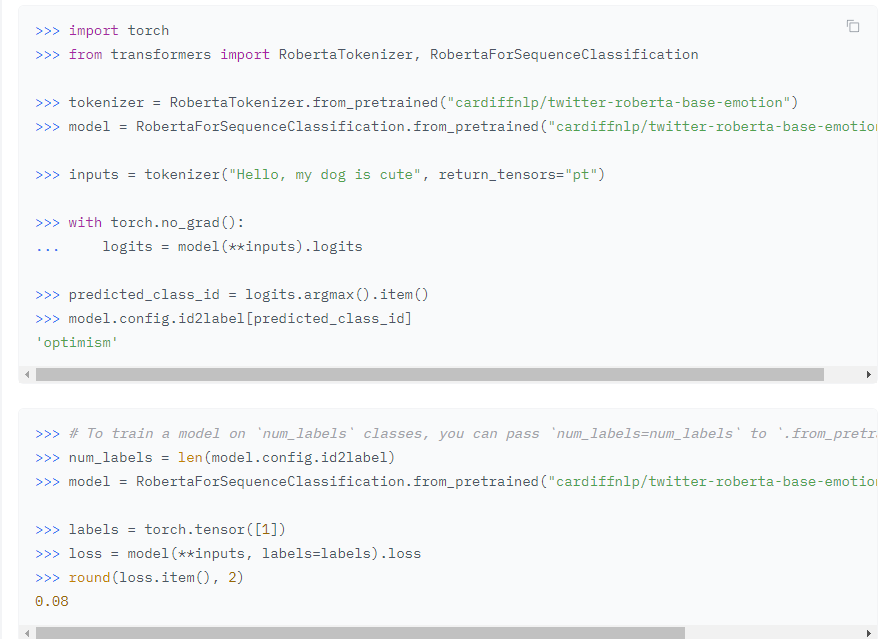
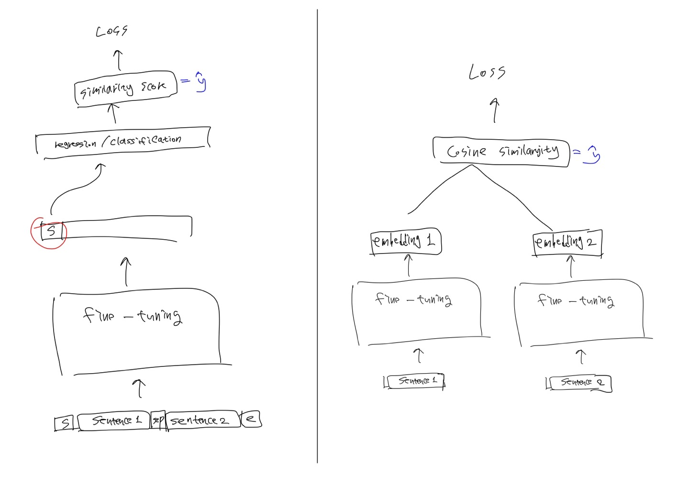

# 10월 27일 팀 회의록
- - -

## 논의 사항

### 과정에 대한 이야기

- 데이터 이해, label 나누는 기준을 알고 싶다.
- 과정을 충실히 쌓아나가고 싶다.
- 과정을 꼼꼼히 기록했으면 좋겠다.

### 모델 및 성능에 대한 이야기

- seed를 각기 다르게 사용하여 결과를 보자.

- output이 어떻게 나오는지, classification/regression 레이어가 쌓인 것인지
   
    - logits 이 결과를 나타내는 것 같은 느낌
    - logits.argmax().item() 부분에서 .argmax().item() 부분 사용하거나 다른것 찾아봐서 결과 봐도 괜찮을 것 같다.
#
- 모델 이해, foward 안에 단계를 쌓는 것
    - [HuggingFace KLUE](https://huggingface.co/models?sort=downloads&search=klue)
    - [Roberta model](https://github.com/facebookresearch/fairseq/blob/main/fairseq/models/roberta/model.py)
- STS 모델링, Sentence를 나누는 방법 존재, 다양한 모델링 방법을 실험해보고 싶다.

- loss를 correlation에 사용할 수 있다.

- K-Fold 구현하겠다.