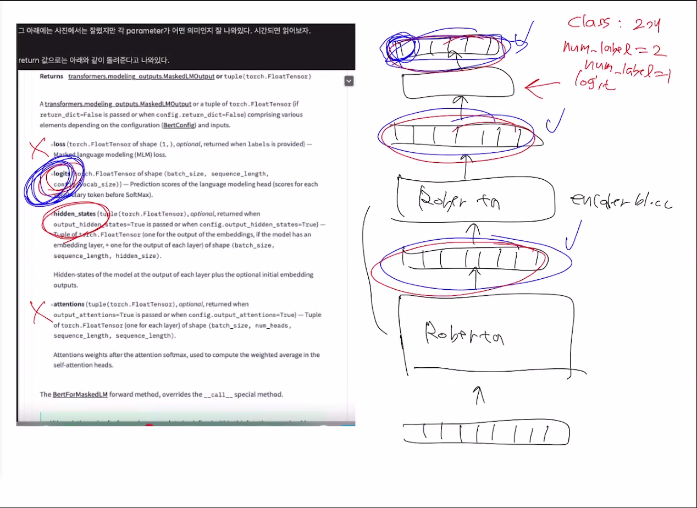

# 10월 31일 오전 팀 회의록
- - -

## 논의 사항

### 불용어 처리 & 전처리
-불용어 처리 성능 향상 크지 않아
- 현존 불용어 모델 사용
- (Korean_stopWords)[https://www.ranks.nl/stopwords/korean]
- 현재 모델 학습에 어떠한 영향을 끼치는지 불분명, 전처리 기준이 필요

### Max_length
tokenizer의 max_length를 늘리는 건 어떤가?
- model positional embedding, 모델 입력 max_length와 혼동
- sentence 1 + sentence 2의 최대 길이가 209인 점을 감안해 보면 max_length를 늘리는 것이 의미가 있을 것 같음
- tokenizer 적용시 padding='max_length'로 str으로 전달이 되는데 어떻게 반영이 되는지 궁금함

### K-fold 적용 건
validation score로 0.98이 나왔으나 test score 향상되지 않았음
- 코드 재점검하겠음

### Logits

Logits이 무엇인가?
- logits : prediction scores of the language modeling head (scores for each vocabulary token before SoftMax)

### Correlation Loss 사용

L1 Loss를 Correlation Loss로 변환
- centering 하지 않았을 때, epoch 50 : 0.84
- centering 이후, epoch 30 : 0.8741

