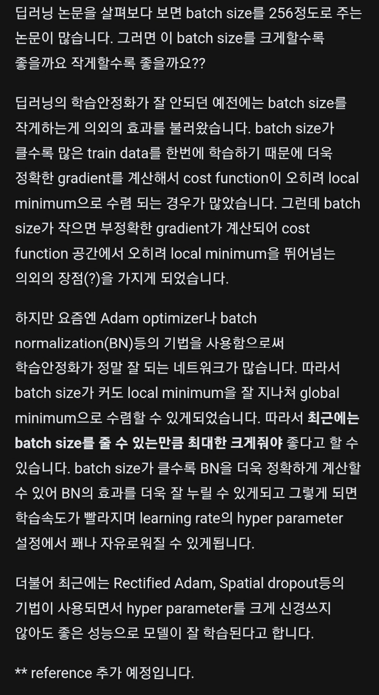

# 11월 1일 오전 팀 회의록
- - -

## 논의 사항

### Validation step 과 Validation Loss에 관한 논의
- Val loss의 값이 언제 나오는지 모르겠다 / 어떤 로직으로 loss나 pearson 값이 나오는지 모르겠다.
- 질의 종합
>- validate - 마지막 batch score냐 batch들의 평균 score이 나오는 거냐    
>- Trainer의 validate 과정     
>- validate step에서 batch를 나누는 것이 의미가 없는 것이 아닌가?    
>- 한번에 집어넣는 것이 아니라 다른 작용이 있는 것인가?    
>- 만약에 최적의 epoch 최적의 step을 어떻게 구하냐     
>- 이것을 구하는 것이 과연 어떤 의미인가     
>- 이것이 만약에 generalization 일반적으로 적용돼서 성능을 향상시킬 수 있는 것이냐     
>- validate_epoch_end method(torch.stack으로 avg loss를 구해주는 함수)가 있는데 이것을 활용할 수 있는 건가, log를 찍을 수 있는 건가    
- - -
- 질의 답변 (Mentor)
>- validation 에서 batch를 나누는 이유는 모든 데이터를 한번에 forwarding할 수 없어서 batch로 쪼개서 metric을 계산하고 이를 평균내서 최종 스코어를 구하게 됩니다
>- 최적의 epoch은 early stopping을 쓸 수 있지만 (크게 효과는 없습니다, 오히려 과소적합되는 경우가 종종 있어요)
>   - 1. kfold validation으로 최적의 epoch을 찾거나
>   - 2. train 과정에서 매 epoch 혹은 일정 iteration 마다 validation을 진행하여 validation 스코어가 높은 지점의 모델을 최종 모델로 선택하게 됩니다'
>- validation_step 메소드 자체는 validation 시 한 iteration에서 수행되는 과정을 정의하는 메소드입니다
>- training_step_end 나 validation_step_end는 각 (training 혹은 validation iteration)이 종료되면 수행할 작업을 정의하는 메소드입니다
>- 그러니까 training_step과 validation_step은 한 에폭 동안 실행이 되고, 한 에폭이 끝나면 training_step_end/validation_step_end가 실행되고 다음 에폭으로 이어지게 됩니다
>- 그래서 validation_step/training_step 시 retrun 되는 값이 리스트 형태로 training_step_end/validation_step_end의 input으로 들어가게 됩니다.
- - -
### Batch size에 대한 자료 공유   
#

- - -