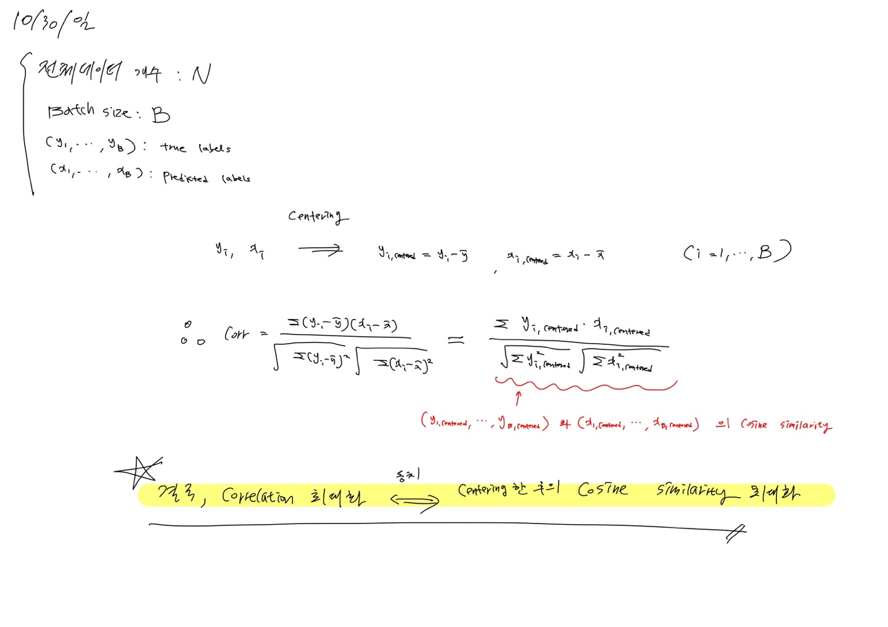
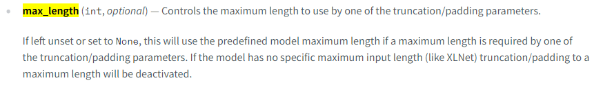

# Work Flow Doucmentation
#### NLP_14조_번역해조
- - -
### MileStones

1. EDA
    - [Simple EDA](../work_indiv/sunghyun/codes/simpler_eda.ipynb)
    - [Label EDA](../work_indiv/sunghyun/codes/label_trace_note.ipynb)
    - [Pos EDA](../work_indiv/sunghyun/codes/pos_eda.ipynb)
2. Correlation Loss  

    - [10월 31일 오전 회의록](../work_integ/minutes/m1031_m.md)
    
3. Tokenizer MaxLength
    - [10월 31일 오후 회의록](../work_integ/minutes/m1031_d.md)
    

